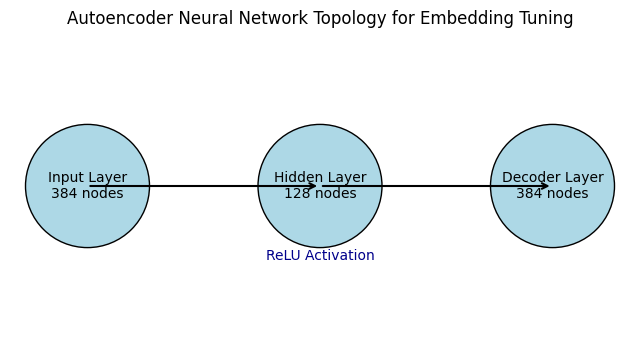

# Supervised Practice - APS 2: Vector-Based Search

## Dataset Description

The dataset consists of profiles of 290 athletes, with each entry providing detailed information about individual achievements, biographical highlights, and significant career milestones. For each athlete, the dataset includes the following attributes:

- **Name**: The athlete's full name.
- **MainContent**: General profile information, including nationality and sport.
- **BioMedals**: Information about the events the athlete participated in and any medals won.
- **BiographicalInformation**: Additional personal information, including achievements and career highlights.
- **Milestones**: Notable moments and achievements in the athlete's career.

### Embedding Generation Process

To create the embeddings, we started with **SBERT (paraphrase-MiniLM-L6-v2)**, which provides meaningful sentence-level representations. We then used a **denoising autoencoder** to adjust these embeddings specifically for our dataset. The autoencoder has three main parts: an **input layer** with 384 dimensions (the SBERT embedding size), a **hidden layer** with 128 dimensions to reduce the data size and capture key features, and a **decoder layer** that restores the data back to 384 dimensions. We trained this model for **10 epochs** using **Mean Squared Error (MSE)** as the loss function and the **Adam optimizer** to improve the embeddings’ relevance to our data.

### Training Process

We trained the autoencoder to fine-tune the embeddings by minimizing the difference between the original and reconstructed embeddings. We used **Mean Squared Error (MSE)** as the loss function, which measures how close the reconstructed embeddings are to the original ones. This choice makes sense because MSE encourages the model to keep the main features of each embedding, which helps make the embeddings more relevant to our specific dataset. To optimize this, we used the **Adam optimizer** with a learning rate of 0.001 and trained the model for 10 epochs.

The MSE loss function is defined as:

$$
\text{MSE} = \frac{1}{n} \sum_{i=1}^{n} (x_i - \hat{x}_i)^2
$$

where \( x_i \) represents each original embedding feature, \( \hat{x}_i \) is the corresponding reconstructed feature, and \( n \) is the total number of features.

